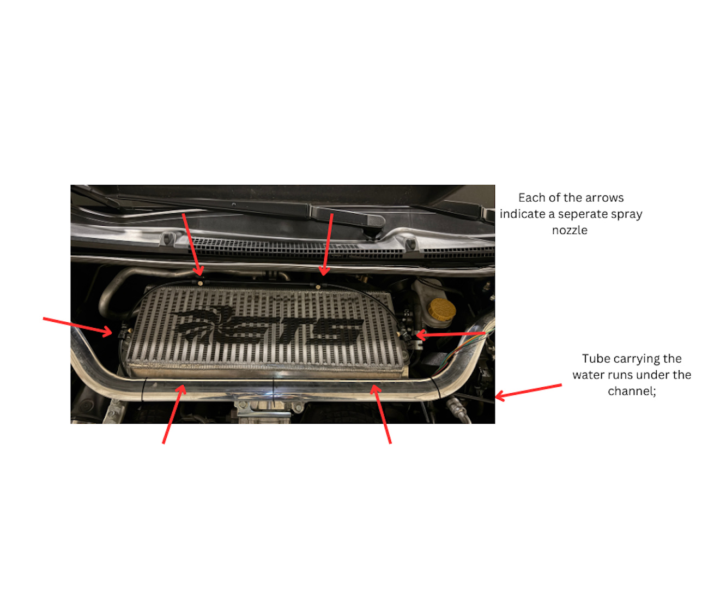
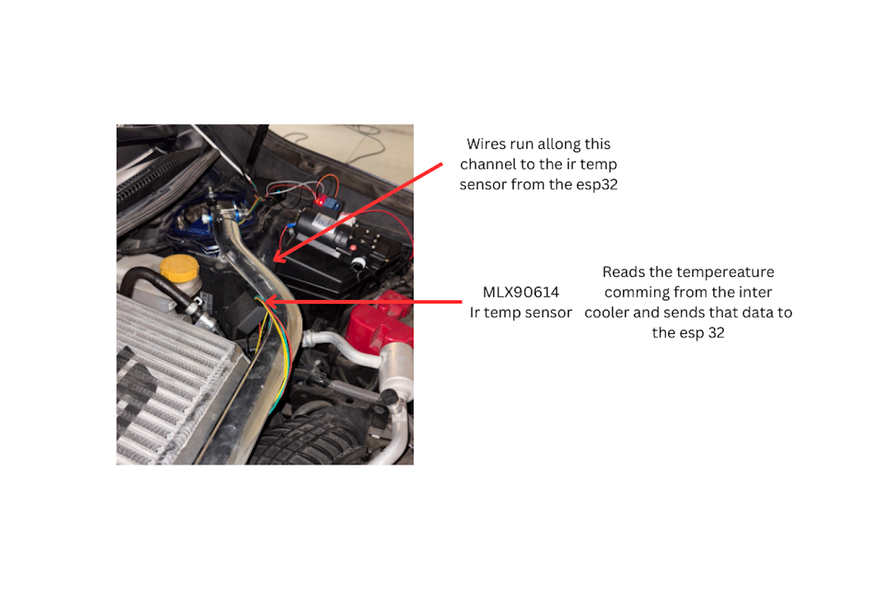
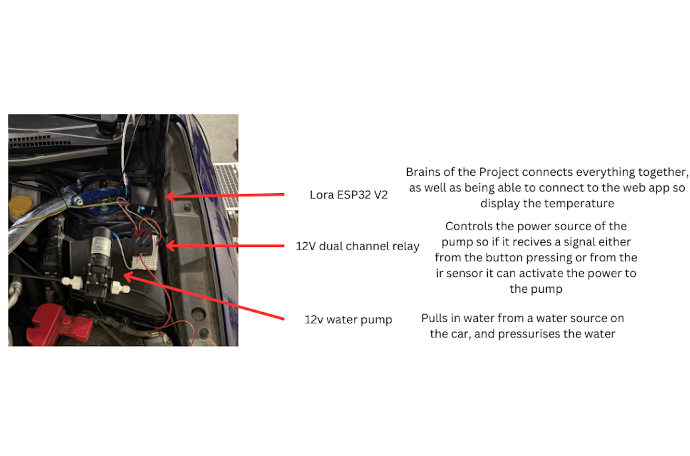
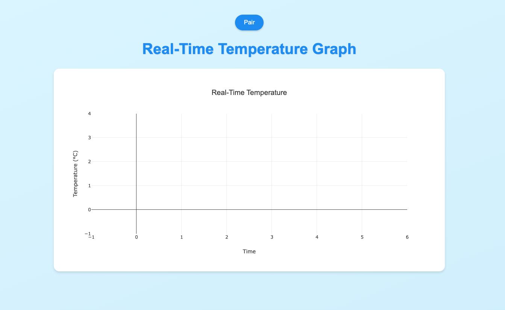
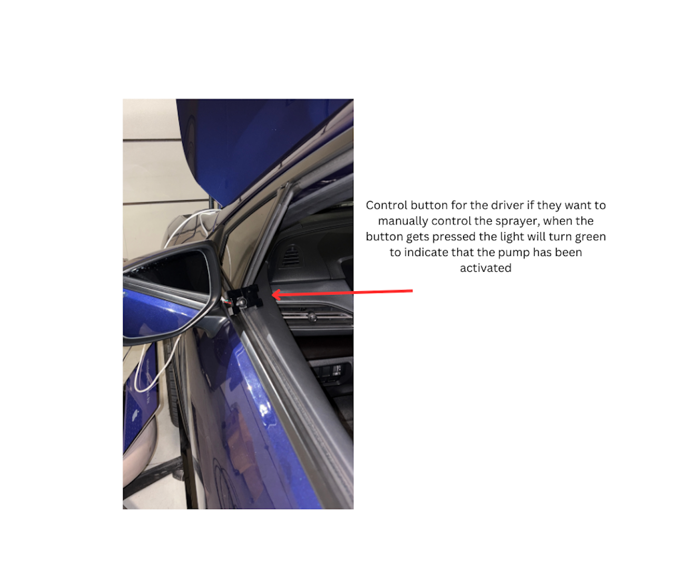

# Temperature Monitoring System 🌡️

A real time intake temperature monitoring system, back in the early years of subaru, owners where able to buy a TMIC(top mount intercooler) sprayer for there turboed car, allowing the driver to spray water on the TMIC to lower there intake temperatures. This project takes that early subaru tech and updates it. 

This allows the driver to be able to monitor there intake temperatures automatically using an IR temp sensor, and once it hits 140°F, the relay controlling the pump will activate and spray the TMIC. I added the option to manually spray the TMIC as well if the driver wants to. 

Another addition was the web app, here the users is able to monitor the temperatures of there intake by connecting with the ESP32 and using bluetooth.

## 🌟 Features

- Real-time temperature monitoring
- Automatic spray system activation above 140°F
- Web interface with live temperature graph
- Bluetooth Low Energy (BLE) connectivity
- Manual control via physical button

##  Hardware Requirements
- Heltech lora esp32 V2
- MLX90614 IR temp sensor
- 5v Relay
- Green led light
- button




## 💻 Software Requirements

### ESP32 Libraries
```cpp
#include <BLEDevice.h>
#include <Wire.h>
#include "HT_SSD1306Wire.h"
#include <Adafruit_MLX90614.h>
```

### Web Interface
- Modern browser with Web Bluetooth API support
- Plotly.js for temperature graphing


## 📊 Usage
The system operates in three modes:
1. **Automatic**: Activates spray when temperature exceeds 140°F
2. **Manual**: Use physical button for direct control


